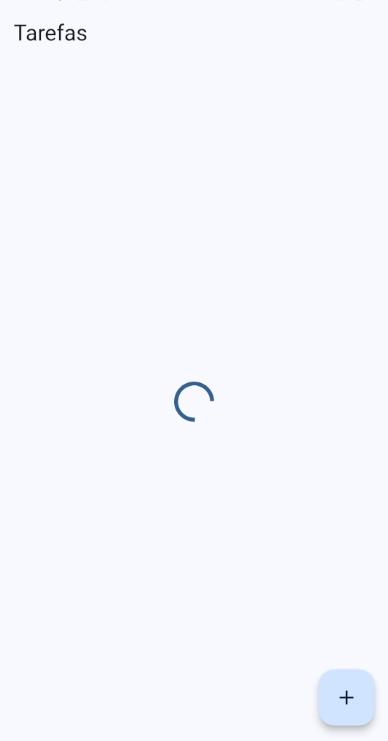
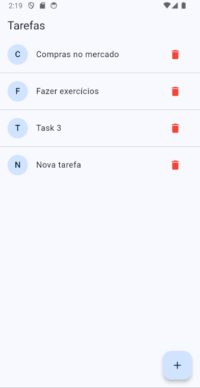

# Todo BLoC App

This project is a simple Todo application built using Flutter and the BLoC (Business Logic Component) pattern. It demonstrates how to manage state in Flutter applications using streams and the BLoC pattern without any packages.

## Features

- Add, delete, and list tasks.
- Uses BLoC pattern for state management.
- Simple and clean UI.

## Getting Started

To run this project, follow these steps:

1. Clone the repository to your local machine.
2. Open the project in your preferred Flutter development environment.
3. Run `flutter pub get` to install the necessary dependencies.
4. Start the application by running `flutter run`.

## Project Structure

- `lib/`
  - `app/`
    - `data/`
      - `blocs/` - Contains the BLoC (Business Logic Component) for managing task state.
      - `models/` - Contains the data model for a task.
      - `repositories/` - Contains the repository for managing tasks data.
    - `pages/` - Contains the UI pages of the app.
  - `main.dart` - The entry point of the application.

## Screenshots

